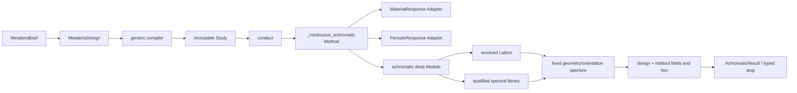

# Publication freeze for evidence-compiled continuous-achromatic metalenses

Status: ready-for-review

Parent: [Freeze the evidence-compiled continuous-achromatic metalens](map.md)

## Outcome

Prepare one publication-grade visible continuous-achromatic metalens route while
preserving MetaCraft's current public lifecycle:

```text
Brief -> compiled Study -> conduct -> admitted Evidence -> Result or typed stop
```

The scientific contribution is an evidence-compiled path from exact intent to
one fixed physical device. It is not a new agent framework, a generic optimizer,
or a second workflow. The public demonstration contains three routes:

1. monochromatic propagation phase;
2. monochromatic PB phase;
3. continuous compensation using geometry-controlled spectral response plus an
   analytical PB orientation.

The third route is inspired by the continuous-compensation physics associated
with the Wang--Tsai and Chen visible-achromat work. It is a local square-cell,
single-rectangle adaptation unless later evidence explicitly establishes a
paper-exact reproduction.

## Scientific contract

For a circularly illuminated transmissive metalens, one occupied aperture site
receives exactly one geometry `g(r)` and one physical orientation `theta(r)`.
Neither may change with wavelength:

```text
Delta L(r) = sqrt(r^2 + F^2) - F
phi_required(r, omega) = -omega Delta L(r) / c + C(omega)
t_converted(g, theta, omega)
    = t_converted(g, 0, omega) exp(i 2 s theta)
```

Geometry supplies propagation/resonant phase, relative group delay,
higher-order residual, conversion, and leakage over the band. Orientation adds
the wavelength-independent PB reference-phase offset under the admitted
polarization convention `s`. At the reference wavelength the realized phase is
the selected geometry phase plus the PB phase. Across the band, the PB term does
not create group delay; the selected geometry's complex spectral response does.

This is therefore not two independent phase masks added after simulation. It is
one anisotropic physical fin whose unrotated Jones response is measured over the
band and whose rotation is then applied analytically.

## Architecture



The following remain unchanged:

- the harness calls only `conduct`;
- the compiler selects the route from intent;
- `MaterialResponse` and `PeriodicResponse` remain the only relevant solver
  seams;
- `_continuous_achromatic` remains the aim-owned Method Module;
- propagation and PB keep their current public `ControlStrategy` values;
- no continuous-compensation `ControlStrategy`, registry, solver factory,
  planner agent, or lifecycle is added.

## One authoritative physical aperture

`focal_length_um`, `numerical_aperture`, and a supplied `ApertureIntent` are all
exact user facts. A later period choice is an admitted design fact. The compiler
must not silently choose one fact over another.

After the period is known, the existing aperture Module resolves one Lattice for
all metalens Methods. For a circular pupil its physical half-span is derived
from focal length and NA:

```text
R = F NA / sqrt(1 - NA^2)
```

The period determines the discrete coordinates. A declared diameter or radius
site count is checked against the corresponding central-line count. If it does
not agree, compilation stops with a typed `aperture_intent_mismatch` containing
the declared and compiled counts. If aperture intent was honestly omitted, the
circular footprint and count are derived and recorded. The occupied-area count
is reported separately and is never confused with a radius/diameter span count.

For the current 470--590 nm, `F=49 um`, `NA=0.2` seed, an admitted 320 nm period
implies a 63-site central diameter, a 65 by 65 storage grid, and 3069 occupied
circular sites. The existing 51-site fixture is intentionally treated as an
inconsistent fixture until it is explicitly corrected; the continuous Method
may not ignore it.

The continuous aperture assignment consumes the resolved Lattice and its exact
reference. It does not recreate coordinates from `F/NA`. Every design and
holdout wavelength reuses that same coordinate array, occupied mask, geometry
map, and orientation map.

## TiO2-first, evidence-decided material policy

Amorphous TiO2 on glass is the preferred first visible-light candidate because
the reviewed 600 nm anisotropic-fin route is close to the current square-cell,
Jones-response, PB, and Lumerical capabilities. This preference is a
recommendation and seed provenance, not a material-name success fact.

Method applicability checks only facts that make the selected physical model
structurally meaningful: continuous band, circular input, transmissive
anisotropic rectangle, compatible control intent, and available Adapter
capabilities. It must not reject an explicit alternative solely because its
family name is not TiO2.

An explicit alternative can then produce exactly one of:

- `selected`: complete material and periodic evidence satisfies the same
  response qualification;
- `unsupported`: the configured Adapter or material library cannot supply the
  required spectral facts;
- `refused`: complete realization-specific evidence fails conversion,
  linearity, phase coverage, delay span, or another closed qualification rule.

The first implementation does not add a GaN, SiN, compound-fin, multilayer, or
freeform template. Such a request may be declared unsupported or refused for
the exact missing/failed realization rather than being mislabeled as a general
material impossibility.

## Traceable spectral study specification

One aim-owned, immutable, content-addressed spectral study specification
replaces unlabelled `_PAPER_*` and qualification constants. Its document records:

- protocol identifier and primary-source provenance;
- single rectangular fin in a square periodic cell;
- the order-safe period-selection rule and 400 nm literature seed ceiling;
- the first-slice fixed TiO2 height of 600 nm;
- the fabrication grid and aspect-ratio constraint from the Brief;
- five design wavelengths and four interleaved blind holdouts over the exact
  band;
- deterministic enumeration of every legal anisotropic rectangle on the
  fabrication grid, followed by reference-wavelength screening and bounded
  spectral follow-up;
- the response-qualification profile and all work-count ceilings;
- the deterministic aperture-assignment objective and tie-break order.

For the current seed, the legal dimensions are 80--240 nm at 10 nm spacing.
Enumerating every unequal ordered rectangle yields 136 geometries, 272
reference-screen works, and at most 2176 follow-up works, for a closed maximum
of 2448 x/y-polarized periodic works before screening reduces the follow-up.
This replaces the exploratory 5-dimension/10-rectangle/180-work slice. Native
execution may only start after the exact specification identity and work ceiling
are visible to the caller.

The specification belongs inside the existing achromatic Module. The harness
does not receive knobs for period, height, wavelength grids, geometry count, or
thresholds, and no family of shallow policy Modules is introduced.

## One qualification verdict

One versioned qualification profile owns the reference screen and full spectral
eligibility rules. One `SpectralLibraryQualification` owns:

- the profile reference;
- complete/incomplete evidence status;
- per-geometry phase, relative-delay, residual, conversion, and leakage
  assessments;
- the exact eligible geometry set;
- phase-coverage and delay-span summaries;
- one candidate or typed refusal verdict.

Aperture assignment consumes the eligible set and verdict. It may not import or
recompute power, linearity, residual, phase-gap, or delay-span thresholds. The
exploratory values remain provisional until the profile ticket verifies and
cites them; changing them changes the profile identity rather than a hidden
global.

## Design claim

This release does not claim a general metasurface inverse-design framework and
does not add a generic optimizer. The local mapping from target delay and phase
to a bounded, qualified geometry/orientation library may be described as a
deterministic discrete inverse assignment, with its objective, tie-breaks, work
budget, and failure modes recorded. The paper's headline claim is
evidence-governed scientific compilation and whole-device closure.

## Three showcase cases and the publication proof matrix

The public source-level story has three showcase cases, without changing the
frozen four-case benchmark catalogue:

| Showcase | Purpose | Required visible artifact |
| --- | --- | --- |
| Propagation phase | Preserve the existing geometry-controlled monochromatic route | target/realized phase, cell geometry, field, focus, Result |
| PB phase | Preserve the existing analytical-orientation monochromatic route | target/PB phase, orientation, converted field, focus, Result |
| Continuous compensation | Add the TiO2-first continuous route | propagation/reference phase, PB phase, their realized sum, fixed layout, spectral focus, Result or typed stop |

Publication readiness is judged by the following evidence rows, not merely by
three successful screenshots:

| Row | Evidence case | Stop condition |
| --- | --- | --- |
| P1 | Current TiO2 470--590 nm target under Native material and periodic response | no candidate, incomplete full-band evidence, or incomplete focus |
| P2 | Same-aperture PB-only chromatic baseline under identical wavelengths, propagation, normalization, and focus evaluation | incomparable aperture or metric contract |
| P3 | Blind interleaved holdouts excluded from spectral fitting | any missing holdout or threshold failure |
| P4 | Neighboring higher-delay challenge intended to exercise correct refusal | false completion or untyped failure |
| P5 | Fabrication perturbations in both lateral dimensions and height under a frozen tolerance protocol | unreported fragility or changed nominal layout |
| P6 | Independent device-scale or cross-method validation of the frozen aperture | missing transfer contract or unexplained disagreement |
| P7 | Interrupted/resumed and replayed run from exact Authority records | changed Result bytes or numerical work during replay |
| P8 | Repeated harness conditions plus an agent-free deterministic baseline | hidden failures, incomparable budgets, or advice treated as evidence |

If P1 produces a complete physics refusal, the software ticket can close but
manuscript writing cannot claim a successful continuous-achromatic lens. The
next scientific move must be an explicit new realization map, not silent
relaxation of NA, aperture, band, qualification, or fabrication constraints.

## Compiled-path projection and the `advice` cache

The publication view is a minimal read-only projection of:

```text
Brief -> Design assessment -> Route/Proof -> Tasks -> Evidence -> Result/stop
```

It carries exact Authority references and cannot restore state. In particular:

- an empty projected `advice` list means no consultation answer has been
  validated, admitted, and retained in the current Study;
- missing advice remains `ConsultationRequired`, not an empty success;
- accepted period/height advice lives in the canonical Study and immutable
  Authority documents, while advice itself remains untrusted and is not
  scientific evidence;
- `src/metacraft/advice/` and `tests/advice/` contain no tracked source. Any
  locally visible `__pycache__` below them is a disposable runtime residue from
  the retired provider-owned package;
- neither `__pycache__`, an outcome JSON projection, nor a run manifest may be
  used as a recovery or truth source.

The old advice package remains deleted. Current advice implementation remains
aim-owned in `science/metalens/period_advice.py`, `height_advice.py`, and the
private `_closed_advice.py` support Module.

## Release artifacts

The open release must include, subject to licenses and redistribution rights:

- exact Briefs, study specification, qualification profile, and schema versions;
- raw material and periodic-response receipts, including incomplete and refused
  work;
- fixed aperture maps and per-wavelength design/holdout fields and focus data;
- the three showcase scripts and the eight-row evaluation runner;
- deterministic replay and integrity checks;
- environment and solver-version receipts, but no credentials or machine-local
  paths;
- archived or manifest-linked primary sources for Self-Evolving, MetaChat, and
  MetaDesigner, plus the deduplicated BibTeX;
- code and data licenses plus a concise reproduction guide.

## Verification gates

- Exact matching and mismatching aperture intents are tested through the shared
  Lattice Interface for monochromatic and continuous routes.
- All design and holdout fields cite one physical aperture and use byte-equal
  coordinate, occupancy, geometry, and orientation maps.
- Qualification is the sole numerical eligibility owner; assignment tests do
  not mirror threshold values.
- TiO2 succeeds only from complete qualifying evidence; an explicit alternative
  reaches evidence, unsupported, or refusal handling without a name-only gate.
- The three showcase routes remain distinct while sharing `conduct` and Result
  replay.
- `advice == []` is retained for an unanswered consultation and cannot restore
  or advance a Study.
- Result conclusion and replay share one internal achromatic restorer and do not
  rerun propagation.
- Focused science, conduct, result, architecture, acceptance, full Pytest,
  Pyright, Markdown-link, canonical-document, source-ratchet, and
  `git diff --check` gates pass with the mandated project interpreter.

## Out of scope

- A dynamic scientific-path registry, generic optimizer, new solver Adapter,
  new public lifecycle, or provider client.
- Paper-exact compound TiO2 fins, polarization-insensitive paired structures,
  GaN IRUEs, freeform topology, multilayers, fabrication execution, or journal
  submission.
- Changing the frozen four historical benchmark identities merely to display
  the continuous route.
- Treating a unit-cell candidate, synthetic fixture, or read-only run projection
  as a completed device.

## Stop rule

The implementation freeze closes only when the implementation tickets are
resolved, the deterministic gates pass, and the Native campaign records either
the complete P1--P8 positive publication chain or an exact evidence-backed stop.
Manuscript drafting begins only after a positive P1, comparable P2/P3,
independent P6 validation, and replayable open artifacts exist.
